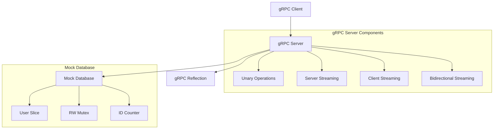

# Design Document

## Overview

The gRPC User Service implementation consists of two main components: a gRPC server that implements the UserService interface and a demonstration client that exercises all available operations. The system uses an in-memory mock database for development and testing purposes, with proper concurrency control and comprehensive error handling.

The implementation demonstrates all four gRPC communication patterns:
- **Unary RPC**: Simple request-response for basic CRUD operations
- **Server Streaming RPC**: Streaming user data with filtering capabilities
- **Client Streaming RPC**: Bulk user creation with batch processing
- **Bidirectional Streaming RPC**: Real-time chat functionality

## Architecture



### Component Responsibilities

- **gRPC Server**: Implements UserService interface, handles all RPC methods, manages concurrent access
- **Mock Database**: In-memory storage using Go slices with thread-safe operations
- **gRPC Client**: Demonstrates all server functionality with proper error handling
- **Reflection Service**: Enables service discovery and debugging tools

## Components and Interfaces

### Server Structure

```go
type server struct {
    pb.UnimplementedUserServiceServer
}
```

The server embeds the generated `UnimplementedUserServiceServer` to ensure forward compatibility when new methods are added to the proto definition.

### Mock Database Design

```go
var (
    mockUsers = []*pb.UserResponse{...}  // Pre-populated test data
    userMutex sync.RWMutex               // Thread-safe access
    nextID    int32 = 4                  // Auto-incrementing ID counter
)
```

**Design Decisions:**
- Uses `sync.RWMutex` for concurrent read/write access
- Pre-populates with sample data for immediate testing
- Maintains auto-incrementing ID counter for new users
- Stores `UserResponse` objects directly for simplicity

### RPC Method Implementations

#### Unary RPCs (GetUser, CreateUser, UpdateUser, DeleteUser)
- **Context Handling**: Check for timeout/cancellation before processing
- **Validation**: Validate required fields and business rules
- **Error Handling**: Return appropriate gRPC status codes
- **Thread Safety**: Use mutex locks for data access

#### Server Streaming RPC (StreamUsers)
- **Filtering Logic**: Support keyword search and role-based filtering
- **Pagination**: Implement limit and offset functionality
- **Streaming**: Send users one by one with artificial delays
- **Error Handling**: Handle stream send errors gracefully

#### Client Streaming RPC (CreateUsers)
- **Batch Processing**: Receive multiple user creation requests
- **Error Aggregation**: Collect individual creation errors
- **Response Compilation**: Return summary with counts and error details
- **Stream Management**: Handle EOF and stream errors

#### Bidirectional Streaming RPC (Chat)
- **Concurrent Processing**: Use goroutines for send/receive operations
- **Message Echo**: Echo received messages back to sender
- **Heartbeat**: Send periodic heartbeat messages
- **Context Management**: Handle stream context cancellation

## Data Models

### Core Data Structures

The system uses the proto-generated structures directly:

- **UserRequest**: Contains user ID for lookup operations
- **UserResponse**: Complete user information with timestamps
- **CreateUserRequest**: User creation data (name, email, password, role)
- **UpdateUserRequest**: User update data with ID
- **UserFilter**: Filtering criteria for streaming operations
- **BulkCreateResponse**: Batch operation results
- **ChatMessage**: Real-time messaging structure

### Data Validation Rules

- **Name**: Required, non-empty string
- **Email**: Required, non-empty, unique across users
- **Role**: Optional, defaults to "user" if not specified
- **ID**: Auto-generated, sequential integers starting from 4

## Error Handling

### gRPC Status Codes Usage

- **codes.NotFound**: User ID not found in database
- **codes.AlreadyExists**: Email already in use during creation
- **codes.InvalidArgument**: Missing required fields or invalid data
- **codes.DeadlineExceeded**: Request timeout occurred
- **codes.Canceled**: Request was canceled by client

### Error Response Patterns

```go
// Standard error response pattern
return nil, status.Errorf(codes.NotFound, "User ID=%d not found", req.Id)
```

### Context Error Handling

All methods check context state before processing:
```go
if ctx.Err() == context.DeadlineExceeded {
    return nil, status.Error(codes.DeadlineExceeded, "Request timeout")
}
```

## Testing Strategy

### Server Testing Approach

1. **Unit Tests**: Test individual RPC methods with various input scenarios
2. **Concurrency Tests**: Verify thread-safe operations under concurrent access
3. **Error Condition Tests**: Validate proper error handling and status codes
4. **Stream Tests**: Test all streaming patterns with various data sizes

### Client Testing Approach

1. **Integration Tests**: Test client-server communication end-to-end
2. **Connection Tests**: Verify connection handling and timeouts
3. **Stream Tests**: Test all streaming patterns from client perspective
4. **Error Handling Tests**: Verify client error handling and recovery

### Test Data Strategy

- Use pre-populated mock data for consistent testing
- Create test scenarios for edge cases (empty data, large datasets)
- Test concurrent operations with multiple goroutines
- Validate proper cleanup and resource management

## Configuration and Deployment

### Server Configuration

- **Port**: 50051 (standard gRPC port)
- **Max Concurrent Streams**: 1000
- **Max Message Size**: 4MB (send/receive)
- **Reflection**: Enabled for development and debugging

### Client Configuration

- **Connection**: Insecure credentials for development
- **Timeout**: 5 seconds for connection establishment
- **Block**: Wait for connection before proceeding
- **Metadata**: Support for authorization headers

### Development Tools Integration

- **grpc_health_probe**: Health check endpoint
- **grpcurl**: Command-line service discovery and testing
- **gRPC Reflection**: Runtime service introspection

## Performance Considerations

### Concurrency Design

- **Read Operations**: Use `RLock()` for concurrent reads
- **Write Operations**: Use `Lock()` for exclusive writes
- **Streaming**: Artificial delays simulate real-world database latency
- **Goroutines**: Proper cleanup and context handling in streaming operations

### Memory Management

- **Mock Database**: In-memory storage suitable for development
- **Stream Buffering**: Controlled message flow in streaming operations
- **Resource Cleanup**: Proper defer statements and context cancellation

### Scalability Considerations

- **Connection Limits**: Configurable max concurrent streams
- **Message Size Limits**: Prevent memory exhaustion
- **Timeout Management**: Prevent resource leaks from hanging connections